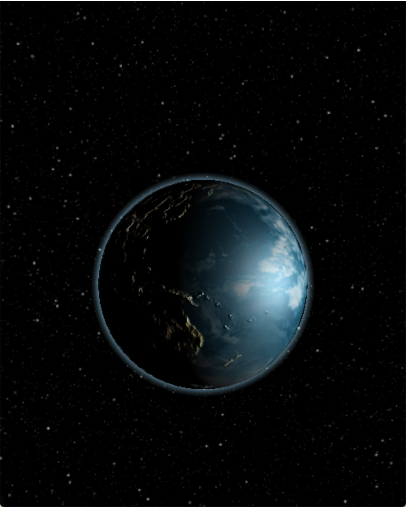
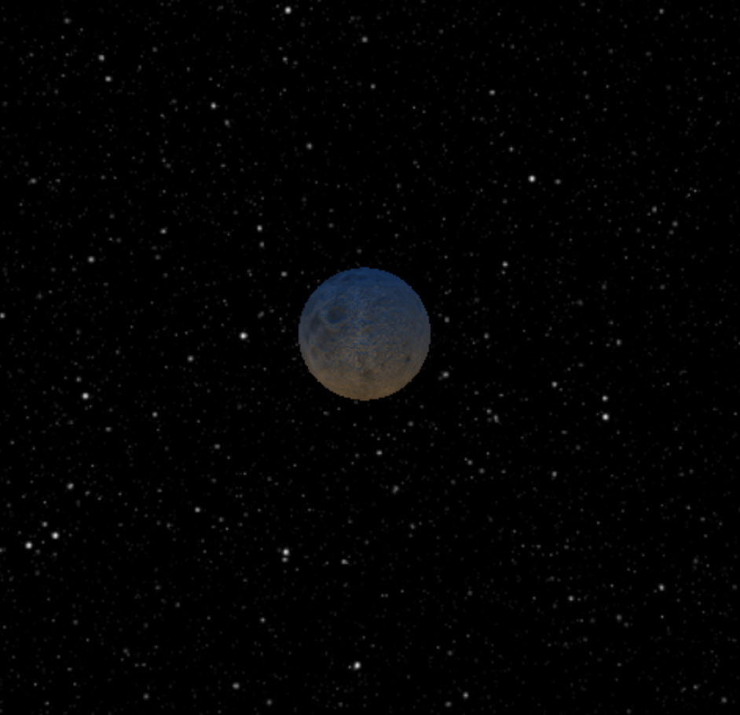
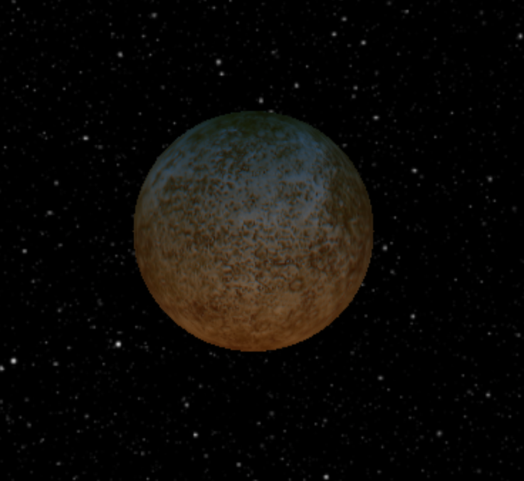
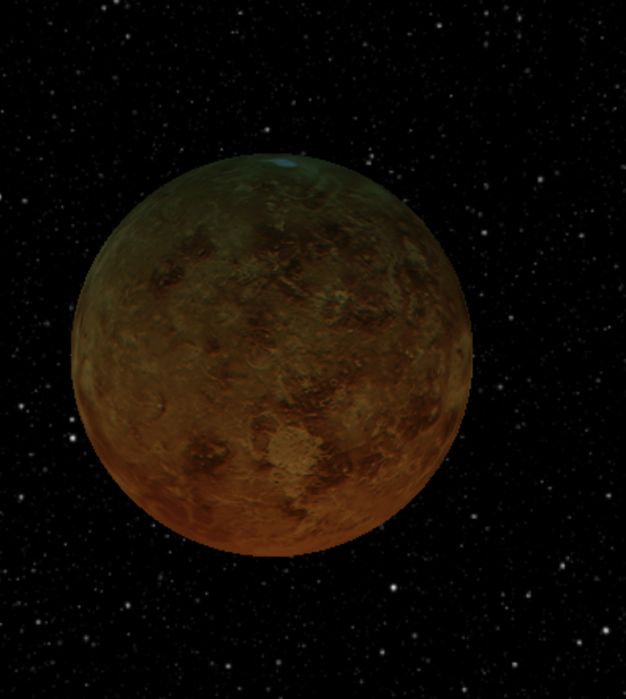
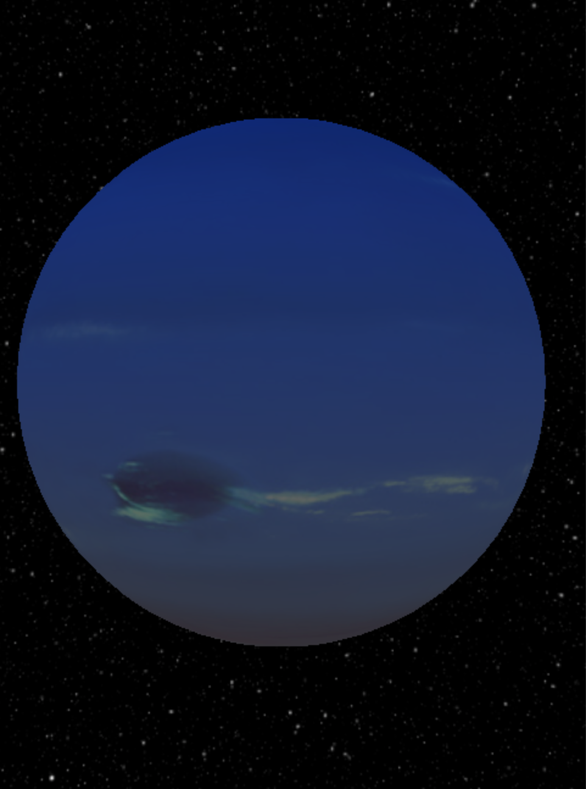
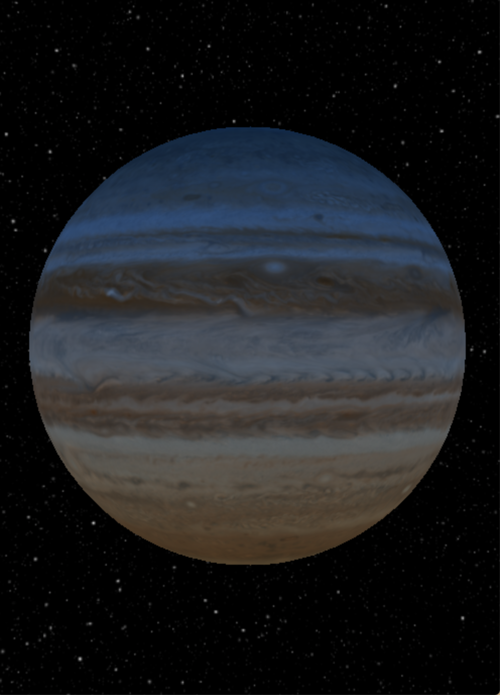
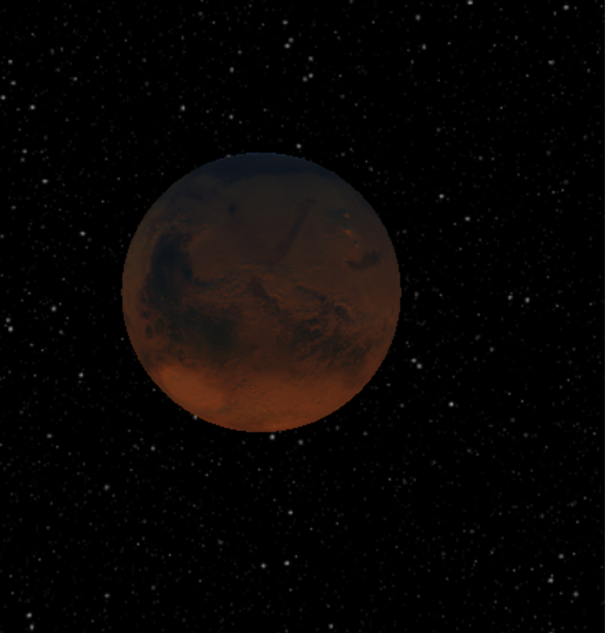

#Demo 
https://determined-tesla-0063a7.netlify.com/


# Key Features

- v1.0 (current)
	- Can Import all Planets into your application
      
- v1.1 (next)
	- Can pass props to all of the planets (orbital_controls=bool, size=num rotation etc etc)
	
- v1.2 (future)
	- Can import all planets into the same canvas and adjust their positions


## How to use
```
npm i react-planetary || yarn add react-planetary
```

```javascript
import {Earth, Uranus, Mars,Venus, Mercury,Moon, Jupiter,Neptune,Saturn} from 'react-planetary/index'
```
- then just call the react component 

```javascript
<Earth/>
```
## Components(version 1.0.0)
- Note all props are optional
- Earth (Props: size) 
- Moon (Props size) 
- Mercury (Props: size) 
- Venus (Props: size) 
- Neptune (Props: size) 
- Jupiter (Props: size) 
- Mars (Props: size) 
### Experiemental Components 
- Uranus <Uranus/>
- Saturn <Saturn/>
